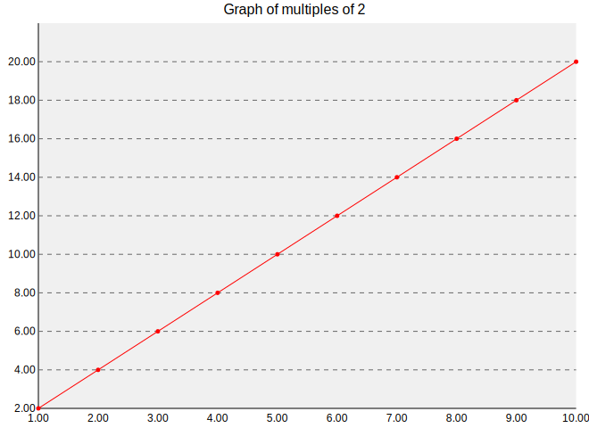
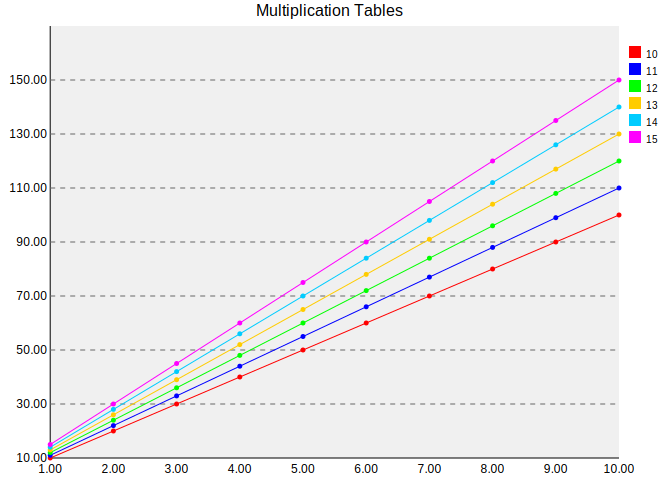

# Graphick

Graphick (a bad play on words of 'graph' and 'quick') is a utility to make generating and maintaining performance analysis graphs for applications much faster.

It has a straightforward DSL for defining data sources and data filters, and caches data and graphs based on the command and parameters so graphs can be added or changed without regenerating all of the graphs specified in the file.

## Example

The following generates a graph of 1..10 to the corresponding multiple of 6.

```
command echo "6 * $num" | bc
title Multiples of six

varying envvar num sequence 1 to 10
data output
```



Every graphick file must have a `command` line. After the word `command` should follow the command that generates the data you are interested in.

Then, you can use a combination of `varying` and `data` directives to define what variables and data your application accepts / outputs, and optionally `filtering` directives to skip certain output lines.

For example, if you had a program that printed comma-separated pairs of ascending numbers along and the time it took to generate them, such as:

```
1, 0.3
2, 0.8
3, 1.6
4, 6.4
...
```

and you want to graph the time it takes to generate powers of two, you can use the following Graphick script:

```
command program
title Time to generate powers of two

filtering column 1 separator , in vals 2 4 8 16 32 64
data output column 1 separator ,
data output column 2 separator ,
```

## Series example

If you have many series of data, and want to be able to contrast it on a graph, you can use the `series` modifier.

If it sees a third `varying` or `data` directive, and it is marked as `series`, Graphick will wrangle your data to produce a graph which has a line for each entry of the corresponding variable. For example, we have a program in `examples/pairwise.rb` which, given a number, outputs the ten times table of that number, e.g.:

```
examples/pairwise.rb 5
1,5
2,10
3,15
...
10,50
```

Using the following Graphick script:

```
command ./pairwise.rb $num
title Multiplication Tables

varying series envvar num sequence 10 to 15
data output column 1 separator ,
data output column 2 separator ,
```

We can generate the following graph:



## Arbitrary post-processing

Sometimes the resultant data from variables and program output is insufficient to generate the desired graphs.

Graphick supports post-processing the data, so it can be re-written in terms of itself.

Currently, only the y-axis can be post-processed but adding support for the x-axis and series should be trivial (PRs welcome).

This is done using the `postprocess_y` directive:

```
command example

varying series ...

# x, y and s (series / data group / line) are automatically defined
# y = x + y + s
postprocess_y x + y + s

# x axis
data ...
# y axis
data ...
```

## Syntax

More formally, the syntax is as follows

```
command       ::= command COMMAND TO RUN
title         ::= title TITLE OF GRAPH
x_label       ::= x_label X AXIS LABEL
y_label       ::= y_label Y AXIS LABEL
series_label  ::= series_label SERIES LABEL (FORMAT STRING)
output        ::= output GRAPH OUTPUT FILE NAME
filtering     ::= filtering <selector> <filter>
varying       ::= varying [series] (envvar VARIABLE_NAME | $variable) <values>
data          ::= data [series] output <selector>
postprocess_y ::= ARBITRARY RUBY CODE

filter        ::= not <filter>
                | in <values>
values        ::= sequence NUMBER to NUMBER
                | vals (VALUE )+
selector      ::= column NUMBER separator SEPARATOR
```

## Installation

Add this line to your application's Gemfile:

```ruby
gem 'graphick'
```

And then execute:

    $ bundle

Or install it yourself as:

    $ gem install graphick

## Usage

TODO: Write usage instructions here

## Development

After checking out the repo, run `bin/setup` to install dependencies. Then, run `rake spec` to run the tests. You can also run `bin/console` for an interactive prompt that will allow you to experiment.

To install this gem onto your local machine, run `bundle exec rake install`. To release a new version, update the version number in `version.rb`, and then run `bundle exec rake release`, which will create a git tag for the version, push git commits and tags, and push the `.gem` file to [rubygems.org](https://rubygems.org).

## Contributing

Bug reports and pull requests are welcome on GitHub at https://github.com/[USERNAME]/graphick.

## License

The gem is available as open source under the terms of the [MIT License](https://opensource.org/licenses/MIT).
